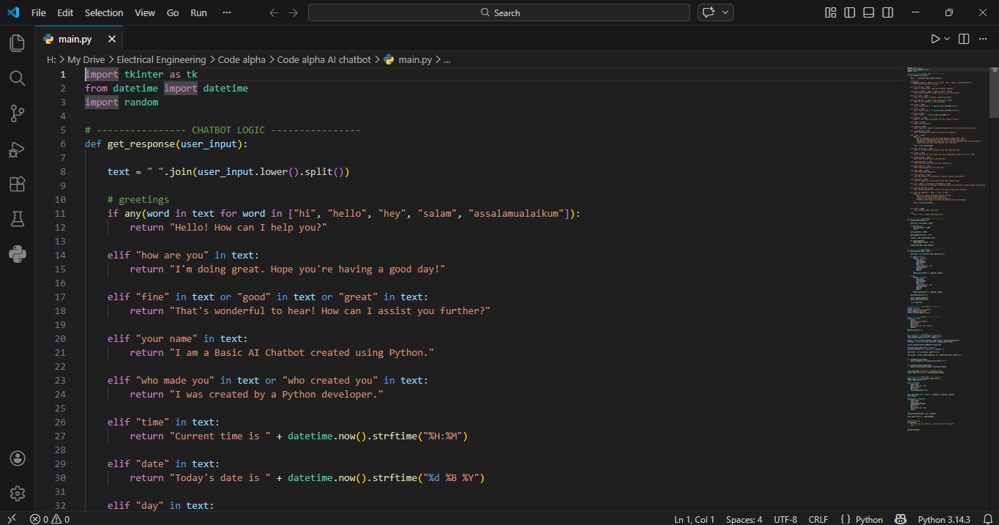
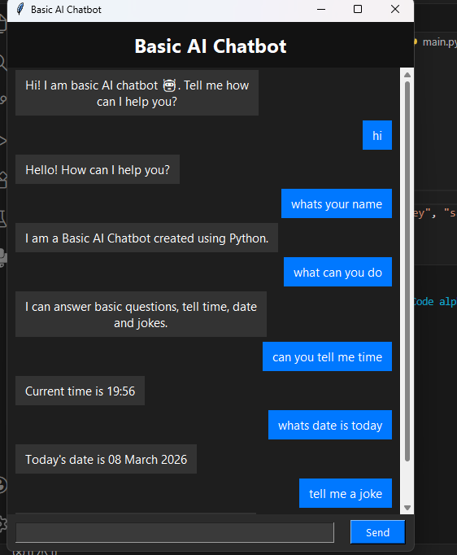

# CodeAplha_Ai-Chatbot
A simple rule-based AI chatbot built with Python and Tkinter for the CodeAlpha internship

**About**

This is a simple AI Chatbot built using Python and Tkinter. It can understand basic greetings, answer simple questions, and respond politely to user inputs. The chatbot is designed to demonstrate the fundamentals of conversational AI in a desktop GUI application. 

**Features**

 • Responds to greetings like "Hi", "Hello", "Salam", etc.

 •Can answer basic questions such as "How are you?" or "What is your name?"

 •Handles unrecognized inputs gracefully with a default response.

 •Interactive GUI with Tkinter for user-friendly experience.

 •Easily extendable with more responses or advanced AI logic.

**How It Works**

 •The chatbot uses Python string matching to interpret user inputs.

 •The GUI allows users to type messages and see chatbot responses in real time.

 •Responses are generated based on predefined keywords and simple rules.
 
 
